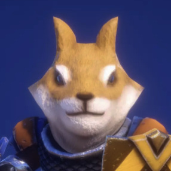
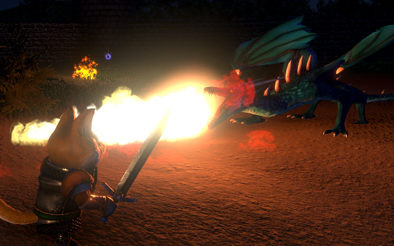
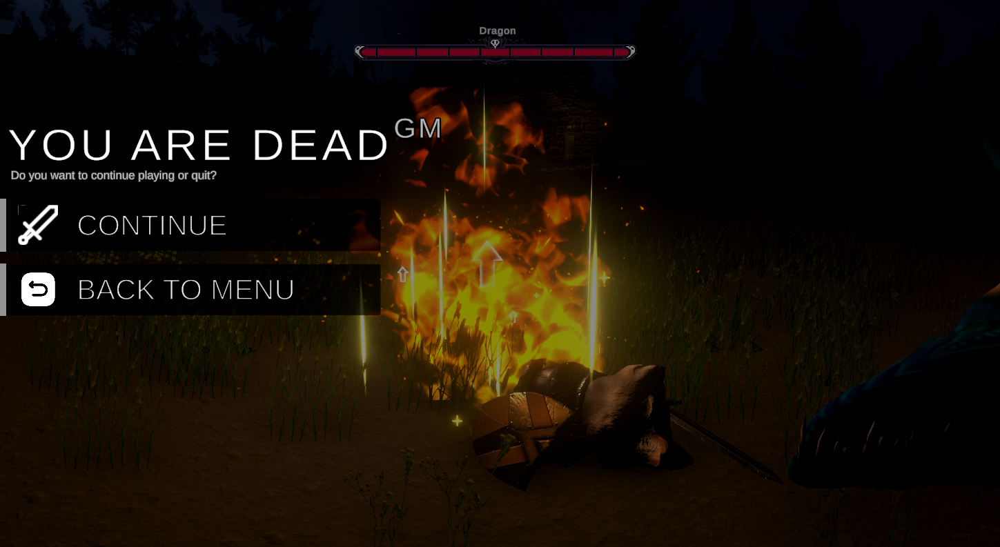

  
  <h1>Doggy Man 3D</h1>
  

    
    
    
    
  

  <i>Unity version: 2022.3.16f1</i>

  

  <b>Create by SEMPA team</b> as open source university project

## Available on these platforms

  
  
  
  

# TODO

* [X] vyzkouseni death menu (pridat mozna nejaky efekt smrti, zobrazeni lebky a az pak zobrazi menu ??)
* [X] Level 1 - Hrac se spawne u sveho horiciho domu, a vydava se na cestu zabit drak a tak se pomstit. Dum se nachazi nekde v polich, hrace se na konci toho levelu dostane na zacetek lesa. (pouzivat jen nepratele: duch, naslapne pasti)
* [ ] Level 2 - Level je cely v lese. Musi byt znat, ze level navazuje na predchozi (hrac za sebou na zacatku vidi ze prisel nekde z poli..). Level se cely odehrava v lese. (pouzivat jen nepratele: duch, pavouk, naslapne pasti)
* [ ] Level 3 - Zacek levelu stale v lese. Po chvili se hrac dostane ne hribtov (zde pouzivat assety pro hrbitov...). Hribuv bude dalsi zbyla cas levelu. Ke konci levelu bude vstup do nejake oblasti "rujn hradu". (pouzivat jen nepratele: duch, pavouk, kostlivec, naslapne pasti)
* [ ] Level 4 - Tento level se odehrava nekde v oblasti rujn stareho hradu, hrad se stale nachazi v tom samem lesek jak hrac vesel na zacatku. Zde pouzivat ty stejne nepratele jak predtim jen vic aby to bylo narocnejsi. Level bude ukoncen nejakou branou.
* [X] Level Finalni - Zde se hra spawn pred vchodem do areny kde bude bojovat s drakem. Arenam bude nejake prostory hradni rujny. V bitevnim poli areny nepouzivat zadne obejkty co by blokovali pohyb drak. Po zabiti se hraci otevre brana a odejde z levelu. 
* [ ] Vytvorit nahledovy obrazek pri spousteni levelu pro level 2, level 3 a level 4. Obrazek vyfotit primo z hry, nejake zajimave misto v konkretnim levelu... Obrazek levelu musi mit pomer stran 1:1 a zaoblene okraje.
* [ ] Vytvorit ukazkove video ze hry do prezentace. Vice zaberu, ze vsech lokaci hry, video sestrihat, doplnit o loga, text,  efekty, ...
* [ ] Vytvorit prezentaci ke hre e
* [ ] Zvuky prostredi: ambientni zvuky lesa, noc, ...

# Preview of progress

# About

# Menu

# Game

# Levels

# Authors

