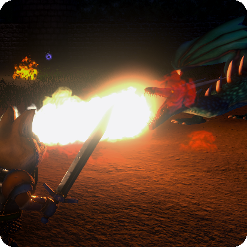

  
  <h1>Doggy Man 3D</h1>
  

    
    
    
    
  

  <i>Unity version: 2022.3.16f1</i>

  

  <b>Create by SEMPA team</b> as open source university project

## Available on these platforms

  
  
  

# About

Doggy Man 3D is an open-source RPG created as a collaborative project by the SEMPA team during their university game-dev course. Immerse yourself in a dark and captivating world as you take on the role of Doggy Man, a valiant warrior on a mission for revenge.

The tale unfolds as Doggy Man's home is razed to the ground by a powerful dragon. Driven by the flames of vengeance, our hero embarks on a perilous journey to seek justice and slay the mighty beast that wrought destruction upon his abode.

Venture through a treacherous landscape filled with formidable foes, engaging in epic battles and overcoming challenges to reach the heart of the dragon's lair. The game is divided into 5 levels, each progressively more challenging, testing your skills and determination.

Doggy Man game is stylized with a dark aesthetic, immersing players in a visually striking and atmospheric world. Experience the thrill of a classic RPG with a gripping narrative, intense combat, and a satisfying conclusion as Doggy Man fulfills his quest by defeating the formidable dragon.

# Menu

### Main Menu:
The main menu offers essential options to enhance your gaming experience. From here, you can embark on a new adventure by creating a new game, resume your journey by loading a previous save. You can also adjust the game's resolution to suit your preferences.

### In Game Menu:
The in-game menu provides: reset the current level for a fresh start, or dive back into the action by resuming your adventure or go back to menu.

# Game

Main character is controlled from a third-person perspective. The player starts with a full number of lives, and if he runs out of lives, his journey ends, requiring a restart of the current level.

Player have the freedom to traverse the game world by walking or running, but with every dash, his stamina diminishes. When stamina runs out, player is unable to sprint until it replenishes, forcing them to wait for a brief moment. Additionally, low stamina levels decrease the effectiveness of attacks, making strategic management of this vital resource essential.

All pertinent information, including health, stamina, and inventory status, is readily displayed in the game's user interface (UI).

Within the game, player have the opportunity to collect various items strewn across the landscape. These items can prove invaluable on their journey and can be stored in an inventory with a capacity limit of four slots. Once the inventory is full, players must decide which items to keep and which to leave/use, adding an element of strategy to their exploration.

### Next screenshot from game:

# Levels

Doggy Man 3D features a total of 5 levels, each escalating in difficulty as player progress through the game. With each new level, players encounter increasingly challenging obstacles and enemies, putting their skills and determination to the test.

Explore diverse environments, confront formidable foes, and uncover the mysteries that await in each level of this epic adventure.

  
  
  

  
  

# Enemies

### Ghost

### Spider

### Skeleton

### Dragon

### Trap

# Items

# Gates
